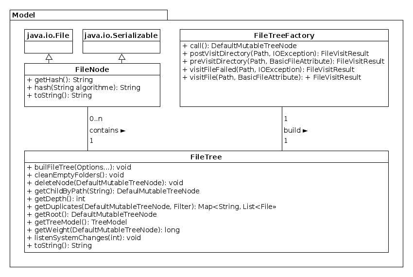
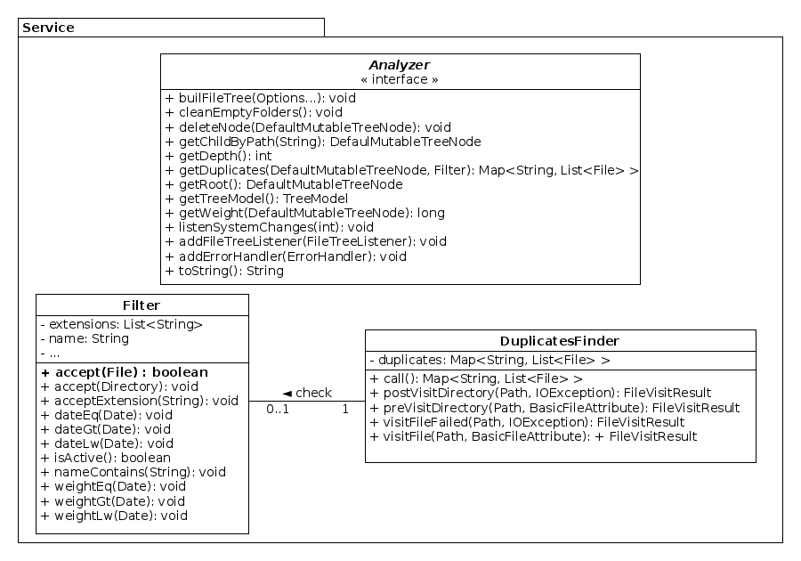
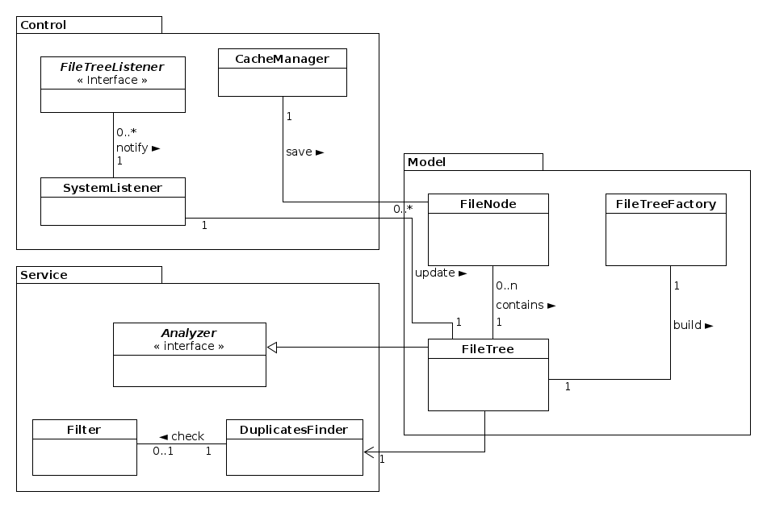

# Projet ACDC compte rendu de première partie

## 1 - Procédure de développement

### 1.1 - Définition du sujet

- Pendant la première partie du projet, nous avons défini mes camarades et moi les services à implémenter pour ce projet.

- Les services en questions étaient:
 
    - Choisir la racine de la recherche.
    - Pouvoir mettre en cache les informations de façons à accélérer la procédure de recherche ou de construction de l'arbre.
    - Récupération des dates de modification, des dossiers et fichiers ainsi que leur taille et toutes les informations nécessaires à l'analyse du système.
    - Récupérer les doublons et avoir la possiblité de les supprimer.
    - Pouvoir filtrer les éléments lors de la création de l'arbre ou lors de la recherche de doublons.

Cependant, j'ai également pu ajouter certaines fonctionnalités:
- La construction de l'arborescence des fichiers en multi-threads.
- L'écoute active du système de façon à mettre à jour le cache et l'arbre en fonction des changements.

### 1.2 - Recherches

La partie fonctionnelle que nous avons défini devait être la plus optimale possible, c'est pourquoi dans un premier temps j'ai effectué de nombreuses recherches.

Pour mettre en place la structure de l'arborescence, j'avais deux choix:
- Utiliser ma propre structure inductive avec le patron composite.
- Utiliser une structure existante en Java.

J'ai choisis d'utiliser la structure _DefaultMutableTreeNode_ en Java car elle facilite la création d'un arbre graphique par la suite, avec _TreeModel_ et _JTree_. Etant donné que nous nous étions tous accordés pour fournir l'arbre sous forme de TreeModel dans le but de l'utiliser directement dans la future interface graphique, DefaultMutableTreeNode était pour moi la meilleure solution.

Pour la construction de l'arbre, j'ai également trouvé deux solutions, la première était de récupérer la liste des fichiers contenus dans chacuns des dossiers avec la méthode ListFiles.
Cette dernière m'est apparu comme simple et efficace aux premiers abords. Mais lorsque j'ai ajouté la possibilité de construire l'arbre en multi-threads, cette solution ne s'est plus avérée viable puisque la méthode ListFiles récupère une liste de fichiers. Cela impliquait donc plusieurs créations d'objets, de façon récursive, le tout dans plusieurs threads, on pouvait y gagner en temps, mais la consommation de la mémoire vive devenait beaucoup plus importante pour la construction de gros arbres.

J'ai alors opté pour une solution basée sur la librairie Java(nio) _WalkFileTree_. Elle dispose des avantages suivants: [WalkFileTree](https://docs.oracle.com/javase/tutorial/essential/io/walk.html)
- Parcours des dossiers et fichiers de façon récursive, et séparément. Une méthode réalise le parcours des dossiers et une autre celui des fichiers.
- Méthode post parcours des dossiers.
- Handler pour les erreurs de parcours des fichiers.

## 2 - Conception et architecture du système

La phase fonctionnelle réalisée s'articule en trois parties. Le Modèle, les contrôleurs et les services.

### 2.1 - Modèle

Le modèle comprend trois classes:
- La classe _FileTree_, qui implémente les principales méthodes définies dans l'API. [FileNode](../doc/Analyzer/Model/FileTree.html)

- La classe _FileNode_ qui est une surcouche de la classe _File_, qui contient toutes les informations relatives aux fichiers, taille, date de modification, hash... [FileNode](../doc/Analyzer/Model/FileNode.html)

- La classe _FileTreeFactory_ qui permet le remplissage de l'arborescence de _DefaultMutableTreeNode_ en Java à partir de la lecture du système via la librairie _WalkFileTree_. [FileTreeFactory](../doc/Analyzer/Model/FileTreeFactory.html)

Lien vers le diagramme: .

### 2.2 - Contrôleurs

Le package _Control_ contient les trois classes qui gèrent les données qui se trouvent dans la structure que nous avons précédement présenté.
- _CacheManager_ est la classe qui gère le cache, notamment au niveau de sa mise à jour, de sa sérialisation, et de sa récupération au lancement du programme. Il permet également les accès asynchrones pour les raisons que nous allons voir par la suite. [CacheManager](../doc/Analyzer/Control/CacheManager.html)

- _SystemListener_, cette classe permet de vérifier après un certain temps que les données de l'arbre sont toujours à jour, sinon, elles sont mises à jour immédiatemment après et lancent des évènements via l'interface FileTreeListener. [SystemListener](../doc/Analyzer/Control/SystemListener.html)

- _FileTreeListener_ est l'interface qu'il est nécessaire d'hériter pour pouvoir écouter les changements qui surviennent sur l'arbre. C'est ce qui permet l'implémentation du patrons Observer sur l'arbre. [FileTreeListener](../doc/Analyzer/Control/FileTreeListener.html)

- _ThreadManager_ est un singleton qui met à disposition des autres classes une instance du framework _Executor_ utilisé pour la gestion des threads. J'ai choisi cette solution car le niveau de parallélisme s'adapte au système qui fait tourner le programme, de plus, ce framework permet de mettre en place des "Pool" de threads dynamiques et qui supportent le Work-Stealing à l'aide d'un processus de mise en cache.

Lien vers le diagramme: .

### 2.3 - Services

Le package Service contient, comme son nom l'indique les services du système. On y trouve l'interface Analyzer qui est la "Façade" d'accès au système, qui fournie toutes les opérations possibles avec ce dernier. Deux autres classes sont aussi présentes dans ce packages, la classe Filter qui permet de créer un filtre pour vérifier la correspondance des fichiers explorés en fonction de certains critères, lors par exemple de la création de l'arborescence, ou bien, lors de la recherche des doublons.
La recherche des doublons est également implémentée dans le package Service par la classe DuplicatesFinder. En effet, cette fonctionnalité ne nécessite pas la création d'une structure, ni le contrôle de données une fois la structure créée, c'est pourquoi on ne la trouve pas dans le package Controler, ou Model. [Filter](../doc/Analyzer/Service/Filter.html), [DuplicatesFinder](../doc/Analyzer/Control/DuplicatesFinder.html), [Analyzer](../doc/Analyzer/Control/Analyzer.html)

Fonctionnement des services:

- **Filtre**: Pour fonctionner, la classe _Filtre_ utilise des booléens qui sont mis à jour lorsque l'on appelle les méthodes qui permettent d'ajouter des restrictions.

- **SystemListener**: Pour fonctionner, cette classe utilise une boucle qui effectue le parcours de l'arbre selon un délai (tous les x milli-secondes, 60000 par défaut) de façon à ne pas prendre trop de mémoire vive dans l'environnement d'exécution de Java. Une fois le parcours effectué, tous les FileTreeListener sont notifiés. Nous aurions pu utiliser une classe déjà existante en Java, la classe _WatcherService_. Cependant cette classe a pour capacité 8000 éléments (en fonction du système cela peut changer), fichiers et / ou dossiers à surveiller en temps réel. Ce n'était donc pas une solution viable pour cette implémentation, étant donné que les disques durs surveillés peuvent êtres de taille bien plus conséquente.

-  **DuplicatesFinder**: Le duplicates finder, ou chercheur de doublons en Français lit le système depuis le chemin qu'on lui indique et fait correspondre un hash avec une liste de doublons. Cette classe utilise la mise en cache des fichiers de la façon suivante. Si le fichier que l'on rencontre dans le système n'est pas présent dans le cache, alors on l'ajoute et on calcule son hash. Sinon on l'ajoute directement dans notre structure de retour.

Lien vers le diagramme: .

## 3 - Fonctionnement du système

Comme nous l'avons précédemment vu, l'ensemble des fonctionnalités proposées par l'analyseur de disque implémenté dans ce projet sont accessibles via l'interface Analyzer. Cette interface est implémentée par la classe FileTree du package Model. En effet, toutes les opérations qui sont à effectuer sont lancées depuis une arborescence, il est donc logique que le modèle de données implémente l'API que nous fournissons. Le modèle, notamment l'arborescence de fichiers de la classe FileTree, ainsi que l'arborescence du système d'exploitation peuvent être surveillés via les contrôleurs qui vérifient les changements des données et qui se chargent de leur stockage en vue de leurs futures restaurations.
Depuis le modèle, et au travers de l'interface Analyzer, on peut également lancer une recherche de doublons, après avoir créé ou non un filtre de fichiers si l'on souhaite restreindre la recherche. Le tout s'articule de la façon suivante: . Je n'ai pas fait apparaître dans le diagramme le singeleton ThreadManager, pour des questions de lisibilité.

### 3.1 - Options et paramétrage du système

Le système a été conçu avec un certain nombre d'options. En effet, selon son choix, l'utilisateur pourra sélectionner certaines d'entre-elles afin d'effectuer les tâches dont-il a besoin.

- Ainsi, la mise en cache de l'arbre à sa construction est facultative, comme le hasahage des fichiers. En effet, j'ai adopté le point de vue d'un possible utilisateur. Selon moi, lorsque j'utilise un logiciel de ce type, l'arborescence est construite avant d'effectuer quelconque opération. Le hashage des fichiers pour trouver les doublons s'effectue donc à la demande. On n'a alors plus besoin de mettre en cache les fichiers de l'arbre dès sa construction. A l'exception du cas où l'on veut "écouter/suivre" les changements du système pour maintenir l'abrorescence à jour. A ce moment là, il est obligatoire d'activer l'option car ce suivit est effectué au travers des données mises en cache.

- La construction de l'arbre peut aussi être limitée par une profondeur maximale. Et peut être effectuée de façon multi-threadée ou non.

- Un filtre peut être indiqué lors de la construction de l'arbre de sorte qu'on puisse construire un arbre des fichiers les plus récents, ou possédants d'autres caractéristiques. Si l'on ne souhaite pas indiquer de filtre pour les données de l'arborescence, il suffit de passer en argument un filtre nouvellement créé.

### 3.3 - Lancement en ligne de commande

Pour lancer le programme en ligne de commande il suffit de se déplacer dans le répertoire qui contient l'archive exécutable IMFDLP.jar. Une fois ceci effectué, il faut taper dans un terminal la commande suivante:

```
java -jar IMFDLP.jar
```

 Un menu d'aide devra s'afficher, comme celui-ci: 

```
# ILMFDLP help page: 

##### Command list #####
# duplicates   -> Getting duplicates from a root path.
# weight       -> Return the weight of the directory path.
# depth        -> Getting the depth of tree builded from the path.
# listenSystem -> Listen system changes. Require -cache option.
# cleanCache   -> Command which is cleaning the tree cache.
# ihm          -> Command allowing to test the graphic rendering of the tree.
####### Options #######
# -c ..        -> Command you want to execute.
# -thread      -> Use thread to build the FileTree. (default: false)
# -hash        -> Hash files while building the tree. (default: false)
# -cache       -> Record files in cache. (default: false)
# -print       -> Print the tree while ending the command (default: false)
# -mD ..       -> Integer corresponding to the max depth of tree you want to build (default: none, 0)
# -d ..        -> Millisecond delay between to checking of the FileTree changes. (default: 60000)
# -p ..        -> Required most of the time (not with test, help commands). Path of your folder, tree.
# -filter ..   -> Regex used to restrict the tree construction. 

```
Comme vous pouvez le voir, ce menu indique les fonctionnalités exécutables en ligne de commande. Avec l'interface graphique, plus d'options seront disponibles car le paramétrage est plus facile, il nécessite moins d'arguments. De plus dans notre cas, à chaque commande que l'on exécute, on relance une instance de la JVM et donc on perd tous nos objets Java, on augmente donc la charge de calcul sion effectue plusieurs commandes à la suite.

Exemples de commande:

* Lancement de la séquence de tests unitaires
```
java -jar IMFDLP.jar test 
```
*  Récupération des doublons contenus dans /mon dossier/
```
java -jar IMFDLP.jar -c duplicates -p "/mon dossier/"
```

Note: Les doubles quotes sont facultatifs si le chemin indiqué ne comporte pas de doublons.

## 4 - Retour personnel sur le projet

### 4.1 - Difficultées rencontrées

Lors de ce projet la tâche que j'ai trouvé la plus complexe était de savoir quelle approche algorithmique allait être la plus efficace. En effet, plusieurs solutions étaient possibles, et de fortes notions de complexités étaient liées à ce projet. De plus, avant de définir l'API avec mes collègues sur ce projet, je pensais effectuer ma propre structure afin qu'elle soit modulable et modifiable aisément. En effet, le fait d'avoir choisi de renvoyer l'arbre sous forme de _TreeModel_ en prévision de la conception graphique m'a obligé a utiliser _DefaultMutableTreeNode_ pour définir l'arborescence dans un soucis de temps de calcul. Or cette structure présente comme principal défaut sa difficulté d'accès, de parcours. Toutes les opérations sur un arbre qui résulte de cette classe s'effectue au minimum en temps linéraire, et parfois en O(n^2). Cela m'a obligé à être particulièremetnt attentif à la façon d'écrire mes algorithmes et d'utiliser le cache.

La récolte des doublons n'était pas chose facile, tout comme la construction de l'arbre. En effet, le hash prend du temps de calcul, il fallait donc trouver l'équilibre entre sauvegarde massive des fichiers dans le cache pour parcourir l'ensemble des doublons ensuite ou bien hasher progressivement les fichiers de façon à répartir le temps de calcul au fil des opérations. Ces deux méthodes ont leur avantages et inconvénients et j'ai du tester les deux, pour voir la meilleure. Finalement je n'ai pas pu trancher, j'ai donc laissé aux utilisateurs le choix de paramétrer ces fonctionnalités.

### 4.2 - Expérience personnelle

J'ai beaucoup apprécié cette première partie du projet malgré les difficultés que j'ai pu rencontré tout au long de sa réalisation. En effet, celui-ci m'a permis d'appréhender le fonctionnement des systèmes de fichiers de manière plus précise qu'auparavant. J'ai également pu me confronter à des problématiques assez complexes et a de nombreux outils pour effectuer ce type de tâches, comme la technologie de surveillance des arborescences multiplateforme, WatchService. C'est particulièrement cet esprit de recherche de la meilleure solution que j'ai aimé dans ce projet.
